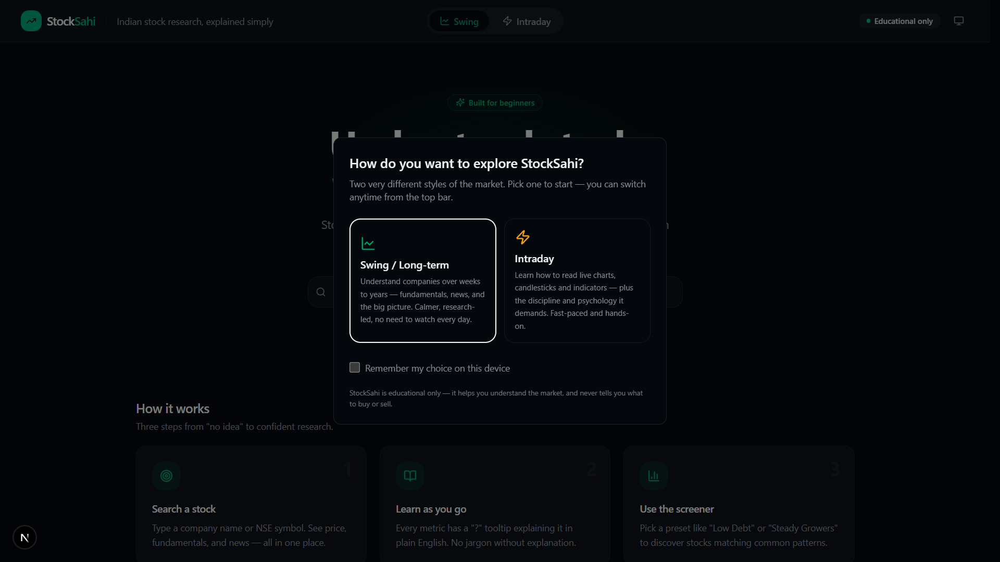
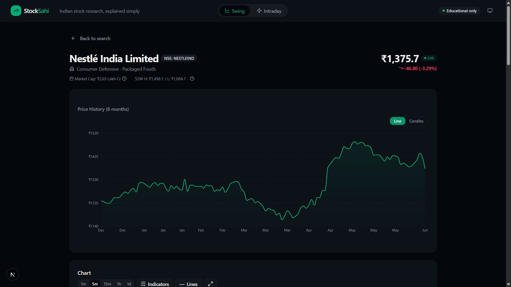
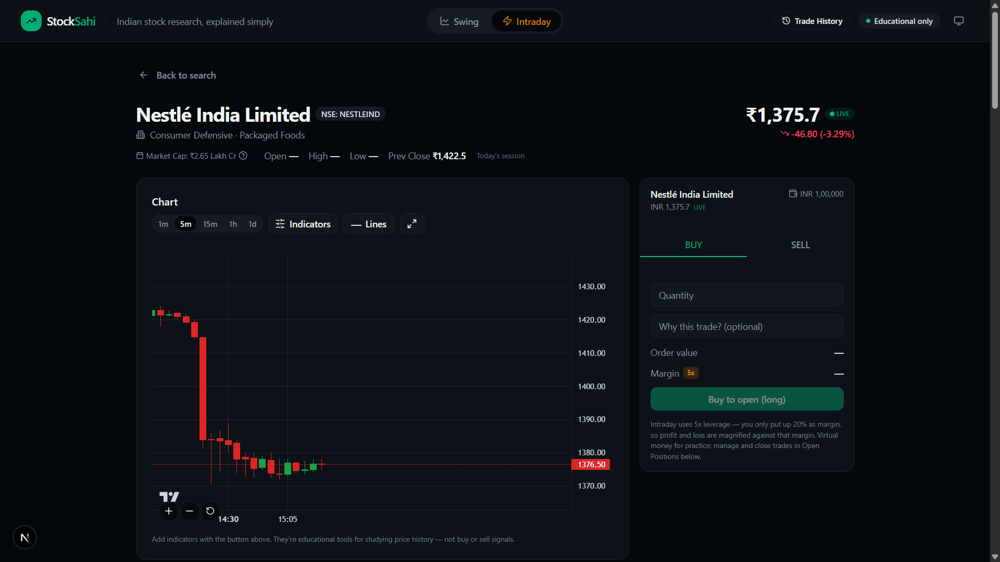
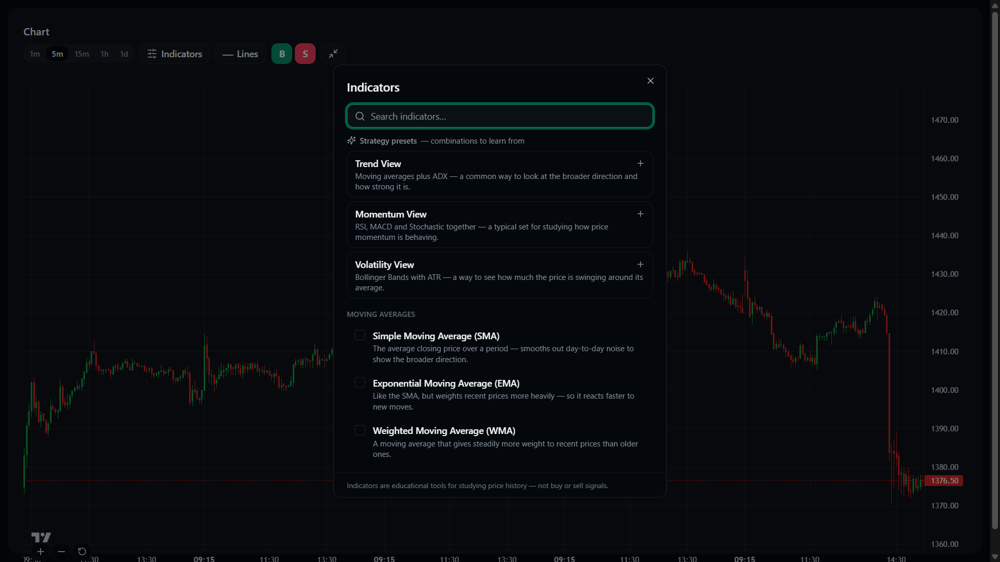
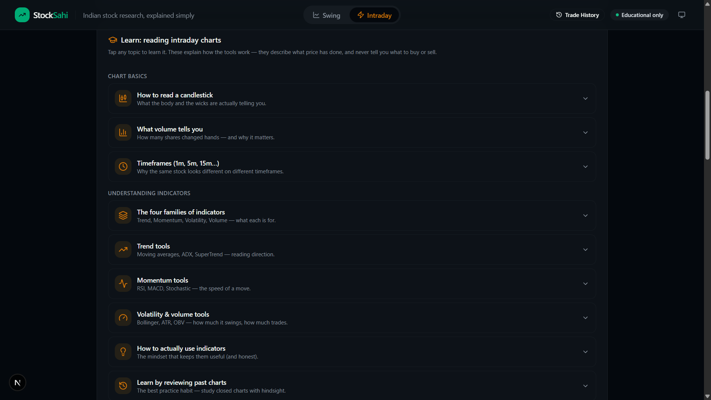
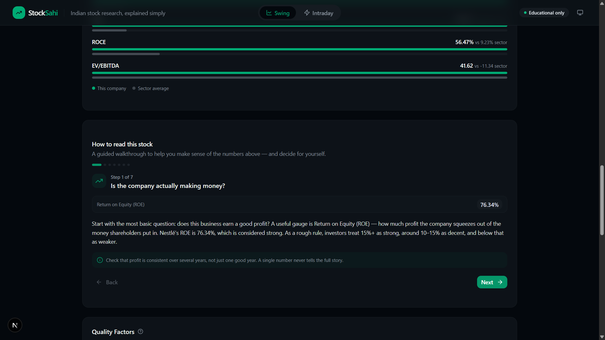
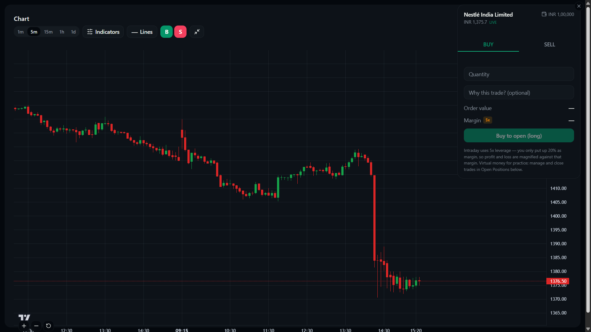

# StockSahi

**Indian stock research, explained simply.**

StockSahi is a beginner-friendly research and learning app for the Indian stock market (NSE). It pairs real market data with plain-English explanations, and it teaches the mechanics of trading honestly — what to look at and why — without ever telling anyone what to buy or sell.

It has two modes: **Swing** (longer-term research — fundamentals, quality, sector context) and **Intraday** (live charts, indicators, and a hands-on learning workspace with paper trading).

> **Educational only — not investment advice.** StockSahi explains and informs; it does not recommend trades, give signals, or suggest target prices. See the disclaimer below.

---

## Screenshots

### Pick your mode
StockSahi opens by asking how you want to explore the market — a calmer, research-led **Swing** style or a fast, hands-on **Intraday** style. You can switch anytime from the top bar.



### Swing mode — research & fundamentals
A clean, beginner-friendly view of a stock: live price, 6-month price history, fundamentals, quality factors, and sector context.



### Intraday mode — live chart & paper trading
A live candlestick chart alongside a paper-trading panel. Trades use virtual money and live prices to practice the mechanics — no real orders.



### Indicators — shown as learning tools
53 technical indicators across trend, momentum, volatility, and volume families, plus "strategy preset" combinations to study. Every indicator is framed as a tool for reading price history, never as a buy/sell signal.



### Learn as you go
An expandable curriculum that teaches how to read charts and indicators, how trading actually works, and the discipline behind it.



### Guided walkthrough
A step-by-step "How to read this stock" walkthrough that explains each fundamental in plain English and helps you reach your own conclusion.



### Full-screen charting
The chart expands to full screen with the trade panel still docked, so you can study price action in detail and place practice trades from the same view.



---

## Features

- **Two research modes** — Swing for longer-term analysis, Intraday for active chart-reading, each with its own focused layout.
- **Real NSE data** — live prices, OHLC candles, and company fundamentals, sourced from the Upstox market-data API.
- **Beginner-first explanations** — every metric (P/E, ROE, EPS, book value, etc.) has a plain-language tooltip explaining what it means and how to read it.
- **Guided "How to read this stock" walkthrough** — a step-by-step tour through a company's fundamentals that explains each number in context and helps you reach your own conclusion.
- **Live intraday charts** — candlestick charts (TradingView Lightweight Charts) with multiple timeframes, zoom, fullscreen, and an on-chart indicator legend.
- **53 technical indicators** — trend, momentum, volatility, and volume families, most with configurable settings. Indicators are shown and taught as concepts, never as buy/sell signals.
- **Paper trading** — a simulated portfolio (₹1,00,000 starting balance, with optional leverage) to practice the mechanics of placing and managing trades using live prices. No real money, no real orders.
- **Honest data handling** — when a data source has no current figures for a stock, StockSahi shows **"Not available"** rather than displaying stale or misleading numbers, and labels the fiscal year of the figures it does show.
- **A real learning curriculum** — expandable lessons covering how to read charts, how trading actually works (orders, fills, costs), risk and discipline, and how to think about building an approach.

---

## Tech stack

- **Framework:** Next.js 16 (App Router, Turbopack) + React 19 + TypeScript
- **Styling/UI:** Tailwind CSS v4, shadcn/ui, lucide-react
- **Charts:** TradingView Lightweight Charts v5 (intraday candlesticks), Recharts (other visuals)
- **Indicators:** `@debut/indicators`
- **Data:** Upstox API (live prices, candles, fundamentals); Yahoo Finance (`yahoo-finance2`) for news
- **Deployment:** Vercel

---

## Engineering decisions

A few choices that shaped the project, beyond just wiring up an API:

- **Polling instead of WebSockets for live prices.** Live data originally streamed over a WebSocket, but persistent connections don't fit a serverless deployment. Live prices are served by polling a lightweight `/api/quote` endpoint, with a **shared client-side poller** so that every component showing the same symbol uses a single request instead of each making its own.

- **Honesty over completeness in fundamentals.** The fundamentals source is current for most stocks, but for some it returns only old data. Rather than show outdated figures as if they were current, StockSahi detects stale data and shows **"Not available."** It prefers consolidated financials when current and falls back to standalone otherwise, and labels each figure with its fiscal year so freshness is visible and verifiable.

- **Protecting a shared upstream token.** All data flows through one shared API token, so the public API routes add **short-lived response caching with in-flight de-duplication** (repeated requests for the same data collapse into one upstream call) plus **per-IP rate limiting** to prevent abuse. (State is in-memory — effective at this scale; a shared store like Redis would be the next step for larger deployments.)

- **Educational, not advisory, by design.** The app deliberately avoids buy/sell calls, signals, and target prices, and frames every feature as something to learn from rather than act on.

---

## Getting started

### Prerequisites

- **Node.js 18+** (Node 20+ recommended)
- **npm**
- An **Upstox API access token** (for market data — see below)

### Setup

1. **Clone the repository**
   ```bash
   git clone https://github.com/<your-username>/stocksahi.git
   cd stocksahi
   ```

2. **Install dependencies**
   ```bash
   npm install
   ```

3. **Add your environment variable.** Create a file named `.env` in the project root:
   ```bash
   UPSTOX_ACCESS_TOKEN=your_upstox_access_token_here
   ```
   This token is read **server-side only** and is never exposed to the browser. (`.env` is gitignored and must never be committed.)

4. **Run the development server**
   ```bash
   npm run dev
   ```

5. Open **http://localhost:3000** in your browser.

### Environment variables

| Variable | Required | Description |
| --- | --- | --- |
| `UPSTOX_ACCESS_TOKEN` | Yes | Upstox API access token used for live prices, candles, and fundamentals. Obtain one from an Upstox developer account. Used only on the server. |

### Build for production

```bash
npm run build
npm run start
```

When deploying to Vercel, add `UPSTOX_ACCESS_TOKEN` as an environment variable in the project settings rather than committing it.

---

## A note on the data

- Market data (prices, candles, fundamentals) comes from the Upstox API; news comes from Yahoo Finance.
- Some stocks may not have current fundamentals available from the data source — these are shown honestly as **"Not available"** rather than with stale numbers.
- Prices update during NSE market hours (9:15 AM – 3:30 PM IST). Outside those hours, the last traded values are shown.
- **Paper trading is fully simulated** — it uses live prices but places no real orders and involves no real money.

---

## Disclaimer

StockSahi is an **educational project**. It is **not** investment advice and **not** a SEBI-registered advisory service. It does not provide buy/sell/hold recommendations, trading signals, or price targets. Nothing in the app should be taken as a recommendation to make any financial decision. Always do your own research and consult a SEBI-registered advisor for personalised advice. Use at your own risk.

---

## License

<!-- Pick one. If you don't want others reusing the code, you can state that explicitly instead of an open-source license. -->
This project is shared for learning and portfolio purposes. _(Add a license here — e.g. MIT — or state usage terms.)_
